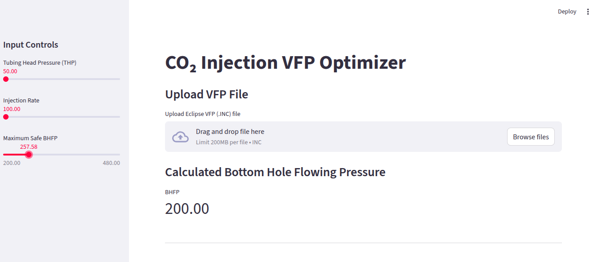
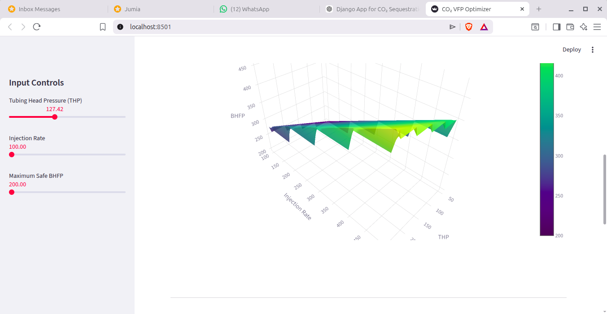
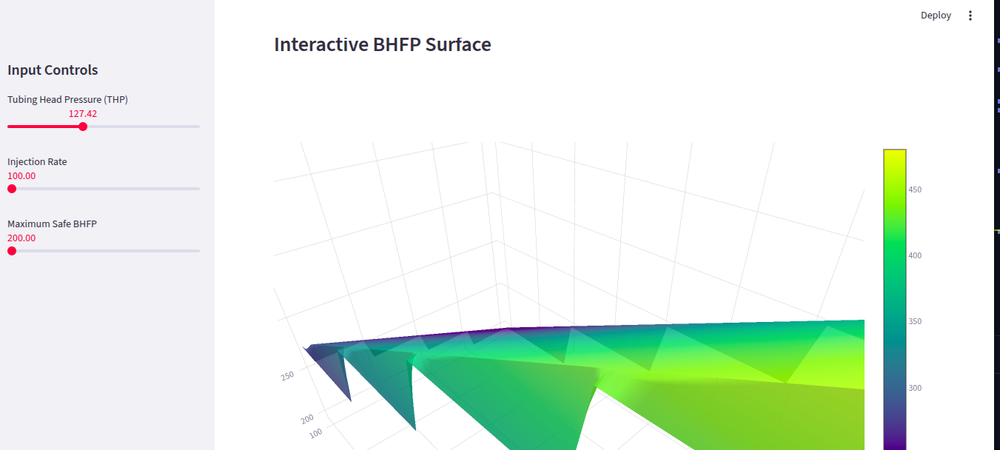

# CO₂ Injection VFP Optimizer

### Reservoir Engineering Optimization Tool

A Python-based engineering application that analyzes **Eclipse VFP (Vertical Flow Performance) tables** to evaluate and optimize **CO₂ injection performance** in reservoir systems.

The tool provides **interactive visualization, pressure estimation, and injection optimization** through an intuitive web dashboard.

---

## Project Overview

This application reads Eclipse VFP tables and performs **bilinear interpolation** to estimate Bottom Hole Flowing Pressure (BHFP) under different operational conditions.

The system then determines the **optimal CO₂ injection rate** while maintaining pressure limits to ensure safe reservoir operation.

---

## Key Features

• Parse Eclipse VFP tables automatically
• Compute Bottom Hole Flowing Pressure (BHFP)
• Interactive engineering dashboard
• 3D visualization of injection performance
• Injection rate optimization under pressure constraints
• Real-time parameter adjustment

---

## Technology Stack

Python
Streamlit
NumPy
Pandas
Plotly

---

## System Architecture

User Input → Data Processing → Interpolation Engine → Optimization Logic → Visualization Dashboard

---

## Application Interface

The dashboard allows engineers to adjust parameters such as:

• Tubing Head Pressure (THP)
• CO₂ Injection Rate
• Flow Conditions

The system dynamically updates:

• BHFP predictions
• Performance curves
• Optimal injection recommendations

---

## Engineering Significance

Efficient CO₂ injection management is critical in:

• Carbon Capture and Storage (CCS)
• Enhanced Oil Recovery (EOR)
• Reservoir pressure management

This tool demonstrates how **data-driven engineering software** can support reservoir decision-making.

---

## Author

Developed by **Leonard Emelieze**

Python | Data Engineering | Energy Systems | Simulation Tools

---

## Future Improvements

• Machine learning prediction models
• Multi-well optimization
• Reservoir simulation integration
• Cloud deployment

## Application Dashboard

## Injection Performance Surface

## Optimization Result

